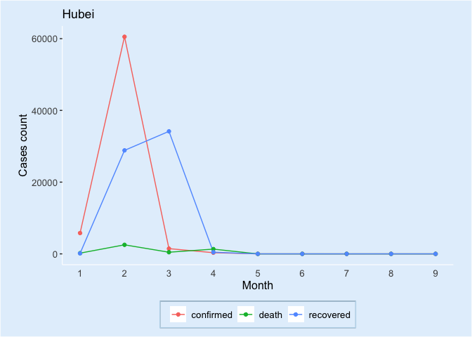

<!-- README.md is generated from README.Rmd. Please edit that file -->

# covid19tracker

<!-- badges: start -->

[](https://github.com/etc5523-2020/r-package-assessment-xhee0013/actions)
<!-- badges: end -->

The goal of covid19tracker is to interactively visualize the situation
of COVID-19 cases in three countries from January to September and
provide a platform for performing and reviewing the change of cases
distribution for each regions in all countries.

## Installation

You can install the released version of covid19tracker from
[Github](https://github.com/etc5523-2020/r-package-assessment-xhee0013)
with:

``` r
# install.packages("devtools")
devtools::install_github("etc5523-2020/r-package-assessment-xhee0013")
```

## Data collection

The data set with COVID-19 information is provided by `coronavirus`
package which is from which is from [RamiKrispin GitHub
repo](https://github.com/RamiKrispin/coronavirus).

This package contains two data sets: `covid19_count` and
`covid19_region`

  - **covid19\_count**: This data set displays the monthly coronavirus
    cases in each country with each region in each country

  - **covid19\_region**: This data set shows the cumulative COVID19
    confirmed cases for each region in three countries.

## Package Functions

This package provides three function to use:

  - **launch\_app**: This function runs the COVID-19 Tracker Shiny App
    exploring the case situation of Coronavirus for each region in three
    countries

  - **summary\_table**: This function create a styled and formatted
    table to represent the summary case situation of COVID19 in each
    country.

  - **input\_option**: This function provides the shiny input options
    for the different variables which are contained in the data sets.

## Example

This is a basic example to show both data sets in this package:

``` r
library(covid19tracker)
library(tibble)
covid19_count
#> # A tibble: 1,395 x 7
#>    Type      province Month country         long   lat Cases
#>    <chr>     <chr>    <dbl> <chr>          <dbl> <dbl> <int>
#>  1 confirmed Anguilla     1 United Kingdom -63.1  18.2     0
#>  2 confirmed Anguilla     2 United Kingdom -63.1  18.2     0
#>  3 confirmed Anguilla     3 United Kingdom -63.1  18.2     2
#>  4 confirmed Anguilla     4 United Kingdom -63.1  18.2     1
#>  5 confirmed Anguilla     5 United Kingdom -63.1  18.2     0
#>  6 confirmed Anguilla     6 United Kingdom -63.1  18.2     0
#>  7 confirmed Anguilla     7 United Kingdom -63.1  18.2     0
#>  8 confirmed Anguilla     8 United Kingdom -63.1  18.2     0
#>  9 confirmed Anguilla     9 United Kingdom -63.1  18.2     0
#> 10 confirmed Anhui        1 China          117.   31.8   237
#> # … with 1,385 more rows
```

``` r
covid19_region
#> # A tibble: 51 x 6
#>    type      country   province                      long   lat Cases
#>    <chr>     <chr>     <chr>                        <dbl> <dbl> <int>
#>  1 confirmed Australia Australian Capital Territory  149. -35.5   113
#>  2 confirmed Australia New South Wales               151. -33.9  4185
#>  3 confirmed Australia Northern Territory            131. -12.5    33
#>  4 confirmed Australia Queensland                    153. -27.5  1149
#>  5 confirmed Australia South Australia               139. -34.9   466
#>  6 confirmed Australia Tasmania                      147. -42.9   230
#>  7 confirmed Australia Victoria                      145. -37.8 19943
#>  8 confirmed Australia Western Australia             116. -32.0   659
#>  9 confirmed China     Anhui                         117.  31.8   991
#> 10 confirmed China     Beijing                       116.  40.2   935
#> # … with 41 more rows
```

### The overall time series trend of COVID-19 case

``` r
library(tidyverse)

covid19_count%>%
  dplyr::filter(province=="Hubei")%>%
  ggplot(aes(x=Month,y=Cases,col=Type))+
  geom_line()+
  geom_point()+
  labs(x = "Month", y = "Cases count", title = "Hubei")+
  theme_bw()+
  theme(legend.position="bottom",
        legend.direction="horizontal",
        legend.box.background = element_rect(fill = "transparent"),
        legend.background = element_rect(fill ="transparent",linetype="solid",color = "#BDD9EC"),
        axis.text = element_text(size = 10),
        legend.text = element_text(size = 10),
        legend.title = element_blank(),
        axis.title = element_text(size = 12),
        axis.line = element_line(size = 0.4, colour = "white"),
        plot.background = element_rect(fill = "#e3f0fc"),
        panel.background = element_rect(fill="transparent"),
        panel.border = element_blank(),
        panel.grid.major = element_blank(),
        panel.grid.minor = element_blank(),
        axis.ticks.x.bottom = element_line(colour = "white",size = 0),
        plot.margin = margin(10,20,10,20))+
  scale_x_continuous(breaks = seq(1, 9,1))
```


