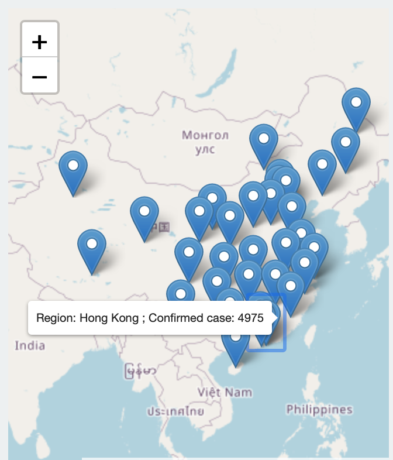
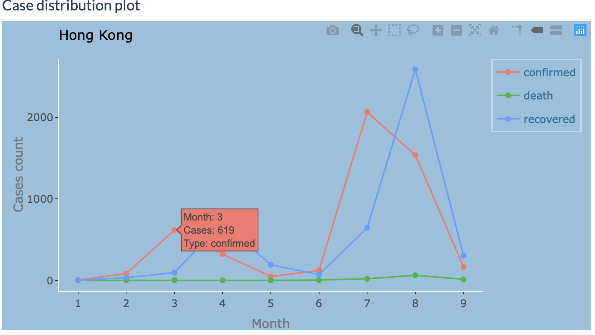
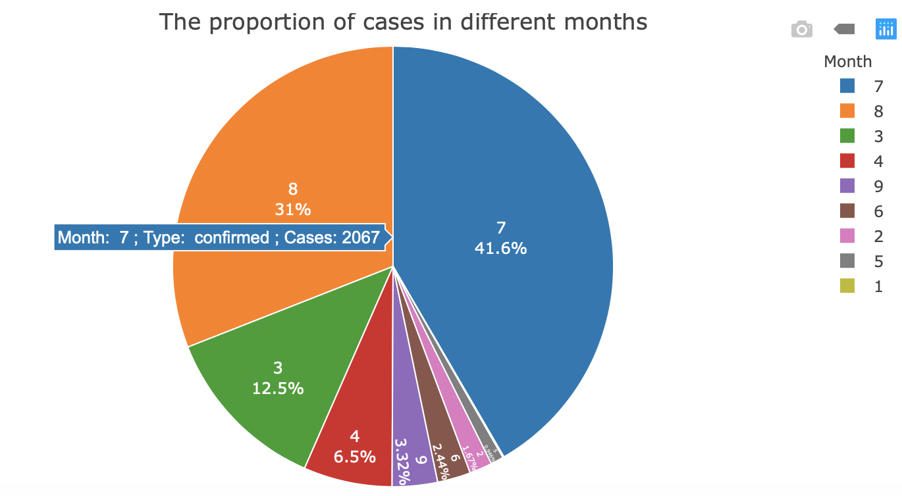
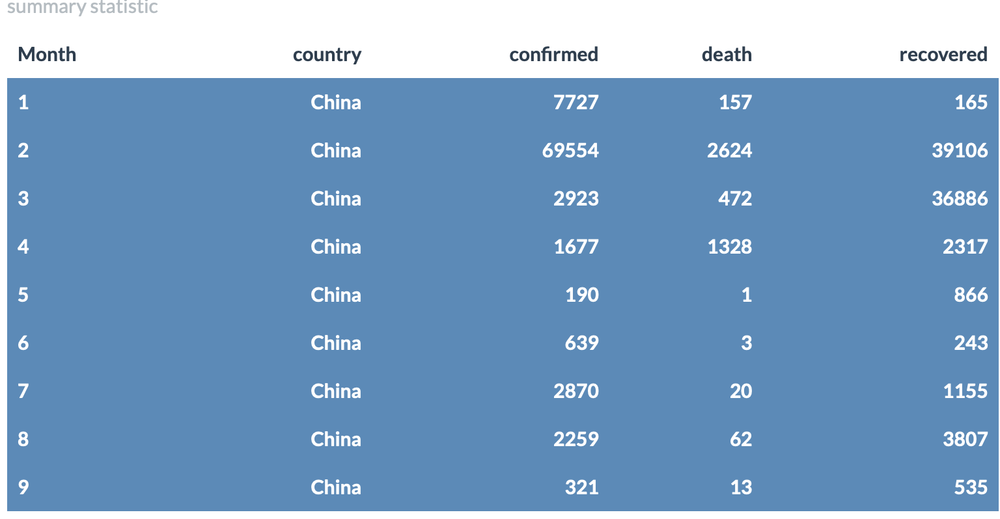

<figure>
  
</figure>

 
## Introduction

The main motivation behind this simple shiny app is designed to interactively visualize the situation of COVID-19 cases in three countries from January to September and provide a platform for performing and reviewing the change of cases distribution for each regions in all countries across time.

Source code and additional information for this application are available via the [XITONG HE GitHub repository](https://github.com/etc5523-2020/shiny-assessment-xhee0013) .  

This application is available under an [GNU General Public License v3.0](https://github.com/etc5523-2020/shiny-assessment-xhee0013/blob/master/LICENSE) .  

 

## Data

All data used by this application are collected through `coronavirus` package which is from [RamiKrispin GitHub repo](https://github.com/RamiKrispin/coronavirus).

The coronavirus dataset consists of measurements of case distribution between countries and regions across time. In this application, the data of three main countries such as Australia, China and United kingdom will be used and constructed a series of analysis to evaluate the situation of COVID-19 pandemic.

 

## Application usage

The application has two main inputs: a country and a region. To build plots for any individual region, select on your desired region in specific country.  

Each region is connected with its own country, and two inputs are responsive to each other. When you select a one country, the regions will be filtered automatically in this country.

The map shows all regions with each country data available. The line plot displayed the case distribution with each selected region and the associated change for each case type. The pie chart represents the proportion of each type of cases in different months,associating with selected input value. The table shows the overall number of case distribution in each country.

The map, line and pie charts inputs are responsive to each other. When you click a region on the map, the line plot will automatically filter to assessments associated with that region. Also, once you selected the point in each month and each case type, the pie chart will automatically filter in the specific value with month and case type and then render the proportion output plot as well.The tables will be rendered automatically when input value updated by using clicking the corresponding country.

Outputs will automatically render any time the user updates one of the input widgets.
 
 

## Outputs

### Map elements

Individual region locations are displayed as circle markers on the map. In addition to displaying confirmed case, the labels and polygons identifying region name, the total number of confirmed case are also available. 

To turn on any of these layers, hover the mouse over the layers control box (top left of map, under zoom buttons) and select one layer,meanwhile, the province input value will be updated automatically once you selected region. Moreover,each country has its own map with region place,therefore, you can update the country value directly by using the select input button to visualize different maps with its regions.

<figure>
  
  <figcaption>Figure 1 - Map usage guide.</figcaption>
</figure>

 

### Line Plot

The line plot with the region name matching your selected will appear in the right site once you click one of regions(eg:selected HongKong in map and the line plot with HongKong will render automatically). Also, the plotly line plots show how the distribution with different type of COVID-19 case changed across time in each region from January to September. The output summarizing patterns in confirmed,recovered and death cases and is given clearly visualization about how the COVID-19 outbreak in each region and when it could become under control(eg:HongKong achieved the peak with confirmed cases in July). 

<figure>
  
  <figcaption>Figure 2 - Line plotly usage guide.</figcaption>
</figure>

 
### Pie Chart

The pie chart is rendered automatically by selecting specific case type in months. Once selecting the specific case type, the output of pie chart represents the proportion of this case type across different months and easy to visualize how the COVID-19 cases distribute in each months with specific case type(eg:HongKong has 2067 confirmed cases in July which is more than 40% compared with other months )

<figure>
  
  <figcaption>Figure 3 - Pie chart plotly usage guide.</figcaption>
</figure>
 

### Summary Table

The table will be rendered automatically once you updated the country input. In addition, the table represents the summary statistics of case distribution in each country from January to September and the number of each case type in different months.

<figure>
  
  <figcaption>Table 1 - Summary table usage guide.</figcaption>
</figure>

 
 

## Author

XITONG HE, master of business analytics in Monash University

contact email: karen.xt.he@gmail.com

